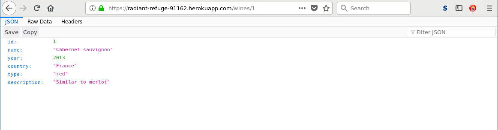
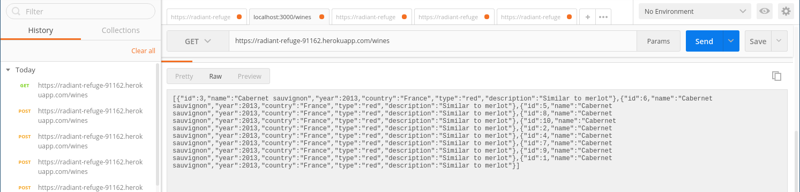
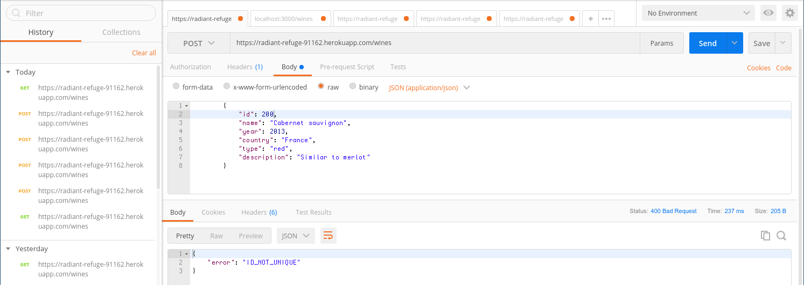

# test

A simple test project for implementing a REST-API using Node.js.

### What it looks like in action

***

### Accessing a pre-installed version of this project
The REST-API that this project implements is permanently located at
[https://radiant-refuge-91162.herokuapp.com/wines](https://radiant-refuge-91162.herokuapp.com/wines).

***

### Building and running the project yourself
You will need Node.js (obviously), NPM, and MongoDB installed in order to execute this project on your
own machine.

#### Files of this project
Below you will find a brief description of the various files of this project:

     Procfile     - default Heroku configuration for cloud deployment
     package.json - project configuration for Node.js app
     doc/         - some additional files for project documentation (you may safely ignore this)
     
     *.js         - the Node.js app files
     test/        - the Node.js test files for the app

#### Environment variables for installing and running the project yourself
This project needs two environment variables to be defined. If you are using bash, you could set them
as follows when running the project locally on your own machine:

     export MONGO_URL='mongodb://localhost/challengedb'
     export SERVER_URL='http://localhost:3000'

That is, if `challengedb` is your MongoDB database name and 3000 the TCP-port of your REST-server.

***

### Testing the project using Mocha

The tests are implemented using the `Mocha` framework.  You could execute them, for example, using
the following command, assuming you have properly downloaded and installed all the required project
dependencies, etc.:

    ./node_modules/.bin/mocha test/index.js --reporter spec

`test/index.js` is the main test suite that organises all the individual test cases. After running it,
and if all goes well, the result should look somewhat similar to this:

